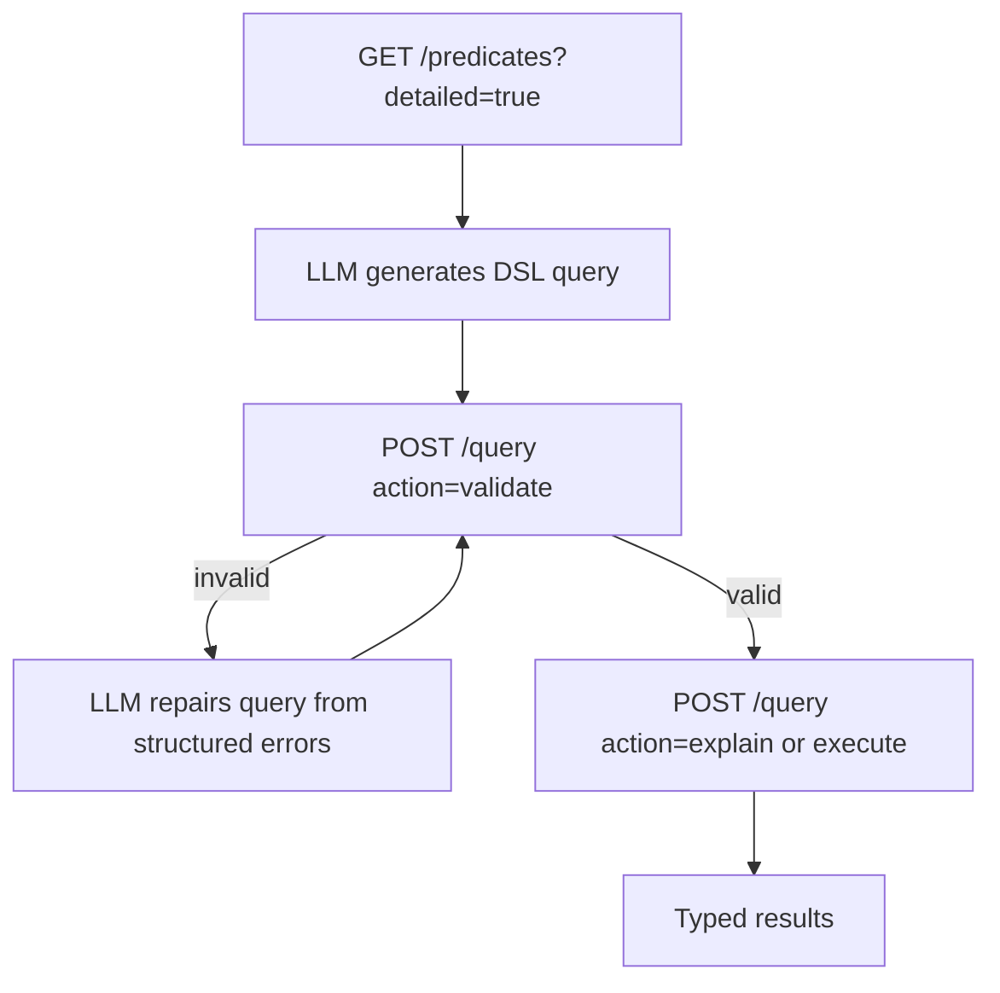

# BeingDB

**Facts versioned like code, queried like a database.**

BeingDB is a Git-first, typed, read-only fact database with deterministic query execution and dataset introspection for LLM/RAG workflows. Facts are versioned and reviewed in Git like source code, then compiled into a fast, typed, indexed runtime for querying.

Modern RAG systems retrieve unstructured text well, but struggle with structured facts. Vector search finds similar documents, but can't reliably answer "Who created this artwork?", "Where was this shown?", or "Which entities are connected through relationships?" BeingDB is not a natural-language system or a vector database -- it answers exactly these questions with typed, deterministic query execution over facts you control.

Your knowledge base evolves like a codebase. Subject matter experts who already use Git for documentation can contribute facts using the same workflow.

## Two Query Languages, One Engine

Facts are Prolog-style predicates—one fact per line—with types inferred directly from literal syntax (atoms, strings, language-tagged strings, integers, exact decimals, booleans, years, year-months, dates, UTC instants, and URIs):
```prolog
created(tina_keane, shadow_of_a_journey).
shown_in(shadow_of_a_journey, rewind_exhibition_1995).
held_at(rewind_exhibition_1995, ica_london).
year_created(shadow_of_a_journey, @1979).
confidence(assertion_1, 0.92).
```

The **core language** queries with pattern matching, joins, and typed comparisons:
```
created(Artist, Work), year_created(Work, Y), Y >= 1970, shown_in(Work, Exhibition)
```

The **expressive query language** adds projection, optional matches, alternatives, negation, ordering, and dataset-aware validation (unknown predicates, arity, and type checks with suggestions), for programmatic use, interactive querying, and LLM-driven RAG workflows -- built on the exact same planner and executor:
```
find Artist, Work
where
  created(Artist, Work)
  year_created(Work, Year)
  Year >= 1970
order by Year ascending
limit 20
```

Repeated predicates are fine -- self-joins and multi-hop chains (e.g. `parent(A, B), parent(B, C)`) work as expected. What's rejected is a *disconnected* query, where two pattern groups share no variable or constant and would silently compute an unconstrained Cartesian product (e.g. `person(P), organisation(O)` with no join between them).

No schema, no complex rules. Your LLM handles reasoning; BeingDB provides the reliable, joinable, typed facts. See [Query Language](docs/query-language.md) for the full reference.

### LLM/RAG integration

The expressive language is designed to be generated by an LLM, checked before running, and re-generated if it doesn't validate -- using `GET /predicates?detailed=true` for dataset introspection and `POST /query` with `action: "validate"` for structured, machine-readable feedback:



### More DSL examples

Filter with a comparison and order the results:
```
find Work, Year
where
  created_in_year(Work, Year)
  Year >= 1980
order by Year
```

Join, with an `optional` match that doesn't discard rows when it fails:
```
find Work, Exhibition, Venue
where
  created(_, Work)
  shown_in(Work, Exhibition)
  optional
    held_at(Exhibition, Venue)
```

`either`/`or` for disjunction:
```
find Work
where
  either
    uses_medium(Work, video)
  or
    uses_medium(Work, video_installation)
```

`not` for negation -- keep a row only when the nested clause has no match:
```
find Work
where
  created(_, Work)
  not
    on_display(Work, false)
```

`distinct` to deduplicate the projected rows:
```
find distinct Medium
where
  uses_medium(_, Medium)
```

## Quick Start

```bash
# Clone sample facts
beingdb-clone https://github.com/jptmoore/beingdb-sample-facts.git --git ./git_store

# Compile to optimized format
beingdb-compile --git ./git_store --pack ./pack_store

# Start server
beingdb-serve --pack ./pack_store

# Query (in another terminal)
curl -X POST http://localhost:8080/query -d '{"query": "created(Artist, Work)"}'

# ...or explore the same store interactively
beingdb repl --pack ./pack_store
```

## Interactive REPL

Prefer command-line interaction over writing `curl` commands? `beingdb repl` (or `beingdb-repl`) opens a compiled Pack store and runs queries straight from your terminal:

```
$ beingdb repl --pack ./pack_store
BeingDB REPL. 6 predicates, fingerprint sha256:3a1f2b7c9e4d5a6f8091b2c3d4e5f60718293a4b5c6d7e8f9a0b1c2d3e4f5a6b, beingdb-dsl/1, mode auto. Type :help for commands, :quit to exit.
beingdb> created(Artist, Work)
{
  "variables": [ "Artist", "Work" ],
  "results": [
    { "Artist": { "type": "atom", "value": "tina_keane" }, "Work": { "type": "atom", "value": "she" } }
  ],
  "count": 1,
  "total": 1,
  "limit": 1000
}
beingdb> :quit
```

See [Getting Started](docs/getting-started.md#interactive-repl) for the full command reference, including `:describe`, `:environment`, `:explain`, `:validate`, `:predicates`, switching languages with `:core`/`:dsl`/`:auto`, and loading facts or batches of queries from a file with `:load`.

## Documentation

- **[Installation](docs/installation.md)** - Platform-specific setup
- **[Getting Started](docs/getting-started.md)** - Complete tutorial with examples
- **[Query Language](docs/query-language.md)** - Patterns, joins, optimization
- **[API Reference](docs/api.md)** - HTTP API documentation
- **[Internals](docs/internals.md)** - Storage architecture and encoding format

**Example facts repository:** [beingdb-sample-facts](https://github.com/jptmoore/beingdb-sample-facts)

## License

MIT
